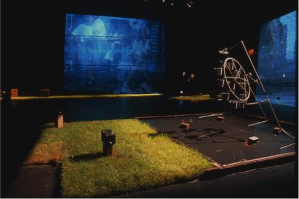

## Setup

A Lorenz water wheel turns in a chaotic manner, because of the holes drilled in the buckets. The wheel's rotation is used to control the audio and video sequences projected in the Caserne Dalhousie gallery.

<iframe src="https://player.vimeo.com/video/340169209" width="640" height="360" frameborder="0" allow="autoplay; fullscreen" allowfullscreen></iframe>

## Références
- Caserne Dalhousie, Québec, Sept. 20-29, 2001.
- A [groupedunes](http://www.groupedunes.fr) production.
- Photos: groupedunes

