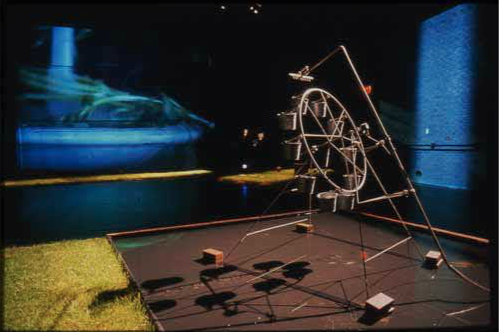
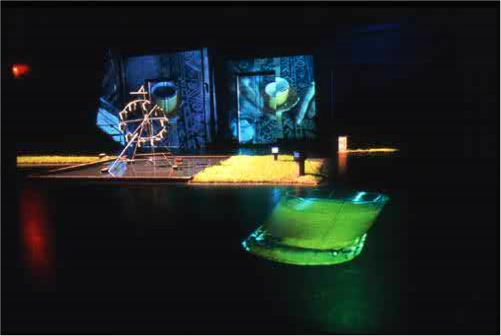
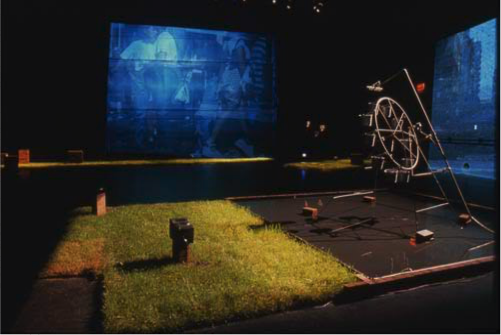
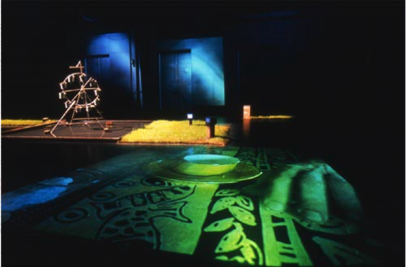
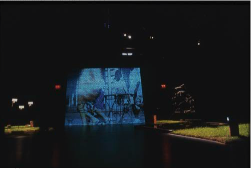

## Principe

Une roue de Lorenz consistuée de sceaux percés tourne d'une manière chaotique. Le mouvement de la roue est utilisé pour piloter les séquences video et sonores projetées dans l'espace de la Caserne Dalhousie.

<iframe src="https://player.vimeo.com/video/340169209" width="640" height="360" frameborder="0" allow="autoplay; fullscreen" allowfullscreen></iframe>

## Références
Caserne Dalhousie, Québec, du 20 au 29 septembre 2001.
Une production du [groupedunes](http://www.groupedunes.fr) en partenariat avec France au Québec/la saison (ministère des Affaires étrangères et ministère de la culture et de la communication A.F.A.A)
