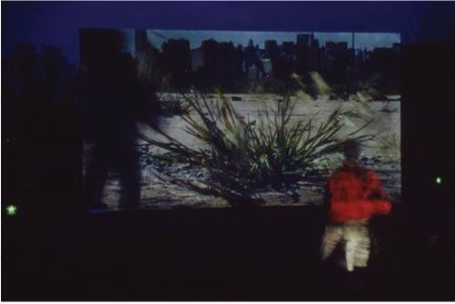

Video and sounds installation in a large outdoor setting. I write the ad hoc conductor software with Max/MSP.

<iframe src="https://player.vimeo.com/video/340165738" width="640" height="360" frameborder="0" allow="autoplay; fullscreen" allowfullscreen></iframe>

## Références
- Ferme du Buisson, Noisiel, Feb. 7-10, 2002.
- A [groupedunes](http://www.groupedunes.fr) production.
- Photos: groupedunes
