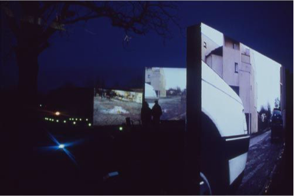

<iframe src="https://player.vimeo.com/video/340165738" width="640" height="360" frameborder="0" allow="autoplay; fullscreen" allowfullscreen></iframe>

## Références
- Ferme du Buisson, Noisiel, du 7 au 10 février 2002.
- Une production du [groupedunes](http://www.groupedunes.fr) avec La Ferme du Buisson et Arte (Festival Temps d'Images)
