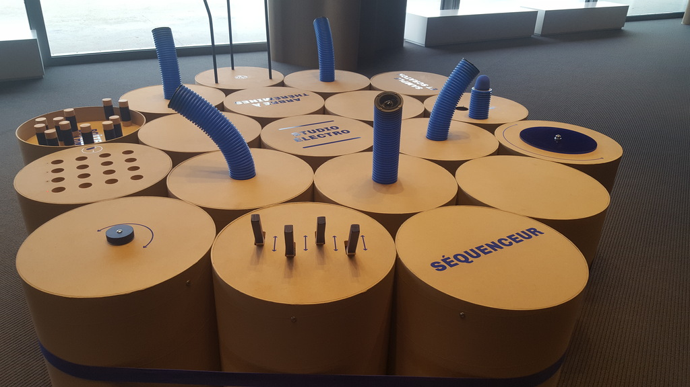

J'ai travaillé à la mise en place de l'expo éphémère La Petite Fabrique à la Philharmonie de Paris.


# Enjeux 
sdlfkj sdlkj 

1. lkjs dfsdf
2. mlksdmflksdf
3. sdfsdfsd

## Et aussi



sqdlk sdlfkj sdf

```
sdfsdfsdf
```
