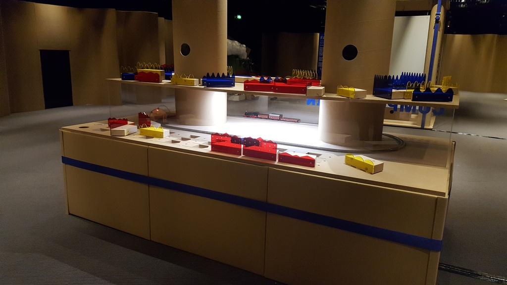
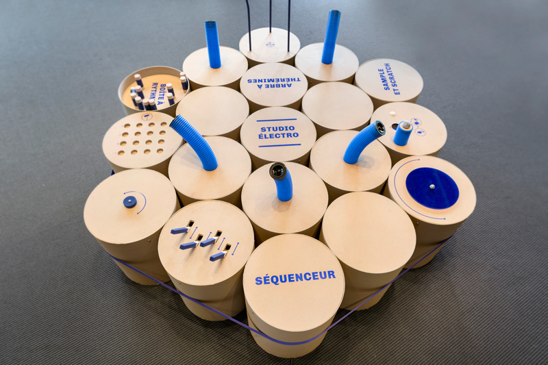
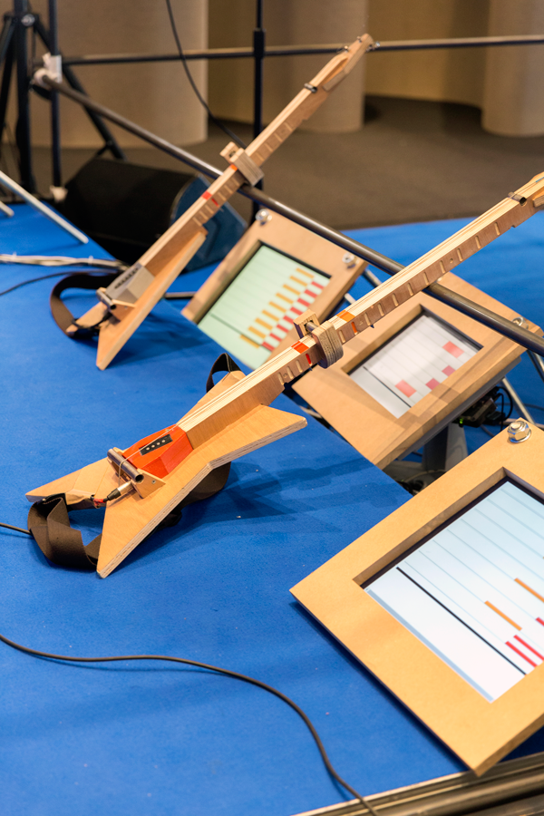
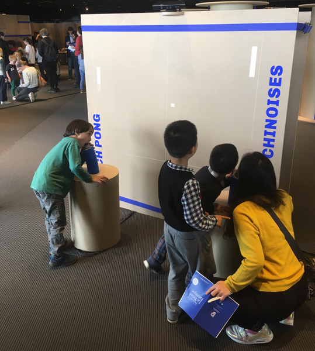

The [Philharmonie de Paris](https://philharmoniedeparis.fr/fr) hall is planning on opening a new space dedicated to kids aged 4 to 10. The project aims to have about thirty installations that will spark kids interest in music making and listening, with open ended musical games.

I took part in the team led by [BrutPop](http://brutpop.blogspot.com/), comisionned to prototype a dozen of these installations, in order to gather user feedback early on in the design process of the exhibit space. 

During the Easter hoilday, our prototypes were tried out by over a thousant visitors.

<iframe width="640" height="360" src="https://www.youtube.com/embed/8XAhJXAWRmU" frameborder="0" allow="autoplay; encrypted-media; gyroscope; picture-in-picture" allowfullscreen></iframe>

Photo: Victoria Tanto