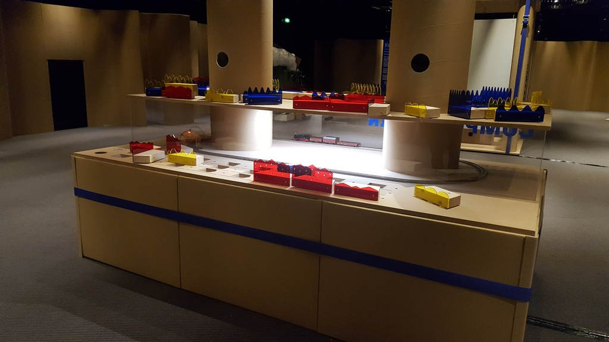
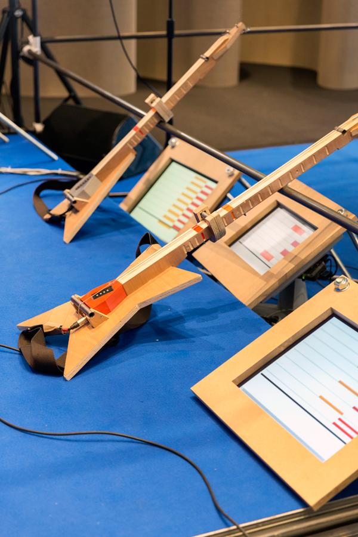

Un nouvel espace dédié aux enfants de 4 à 10 ans est prévu à [La Philharmonie de Paris](https://philharmoniedeparis.fr/fr). Il s'agit de proposer une trentaine d'installations qui suscitent la curiosité musicale des petits à travers des jeux libres. 

J'ai fait partie de l'équipe menée par [BrutPop](http://brutpop.blogspot.com/), chargée de d'imaginer et prototyper une douzaine de ces installations pour les faire valider par l'usage avec des enfants en conditions réelles. 

Au cours des vacances de Pâques, l'exposition a été visitée par un millier d'enfants.

<iframe width="640" height="360" src="https://www.youtube.com/embed/8XAhJXAWRmU" frameborder="0" allow="autoplay; encrypted-media; gyroscope; picture-in-picture" allowfullscreen></iframe>

