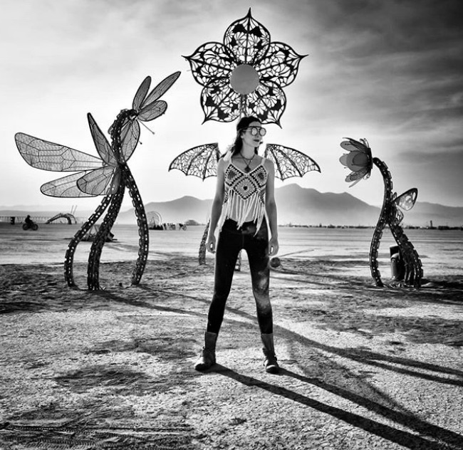

 

Plantoids are monumental plant sculptures made out of steel, designed by Primavera de Filippi. During the 2018 Burning Man festival, the plantoids had dozens of sensors attached to them, so that people would be able to control and play music from nearby loudspeakers. 

I designed the audio engine as well as several music presets. 

<iframe width="100%" src="https://clyp.it/1xnaq5f1/widget" frameborder="0"></iframe>

<iframe width="640" height="360" src="https://www.youtube.com/embed/zFXxAfr3KBU" frameborder="0" allow="autoplay; encrypted-media; gyroscope; picture-in-picture" allowfullscreen></iframe>

Photo: Stéphane Lanoux.
