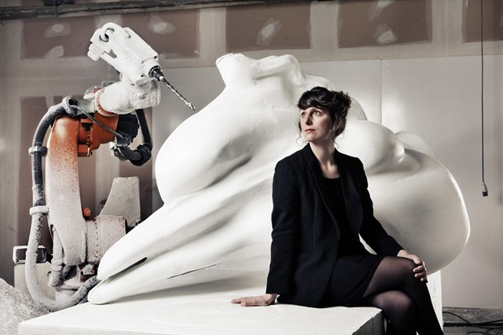

Artist [Marguerite Humeau](https://www.instagram.com/marguerite_humeau/) hired me to come up with imanaginary sounds made by extinct mamals. Due to their nature, vocal tissues of such creatures have not fossilized, and thus one can not scientifically simulate their sound, however, one can speculate them, based on the proximity with their live descendants. 

I started of from a vocal tract synthesis model, and had the parameters evolve with some genetics algorithm, so to generated hundreds of related call sounds, which evolve from one another throughout the lasting of the exhibit.

The installation was shown during the [St Etienne design show](https://www.artshebdomedias.com/article/101212-politique-fiction-saint-etienne-quand-un-mammouth-elargit-le-debat/), as well as in a Berlin gallery, and featured in [Wired magazine](https://www.wired.co.uk/article/roars-remade).

<iframe width="100%" height="166" scrolling="no" frameborder="no" allow="autoplay" src="https://w.soundcloud.com/player/?url=https%3A//api.soundcloud.com/tracks/78841948&color=%237c7c7c&auto_play=false&hide_related=false&show_comments=true&show_user=true&show_reposts=false&show_teaser=true"></iframe>

- Audio recording: Sébastien Tondo
- Photo: Wired Magazine (UK edition)