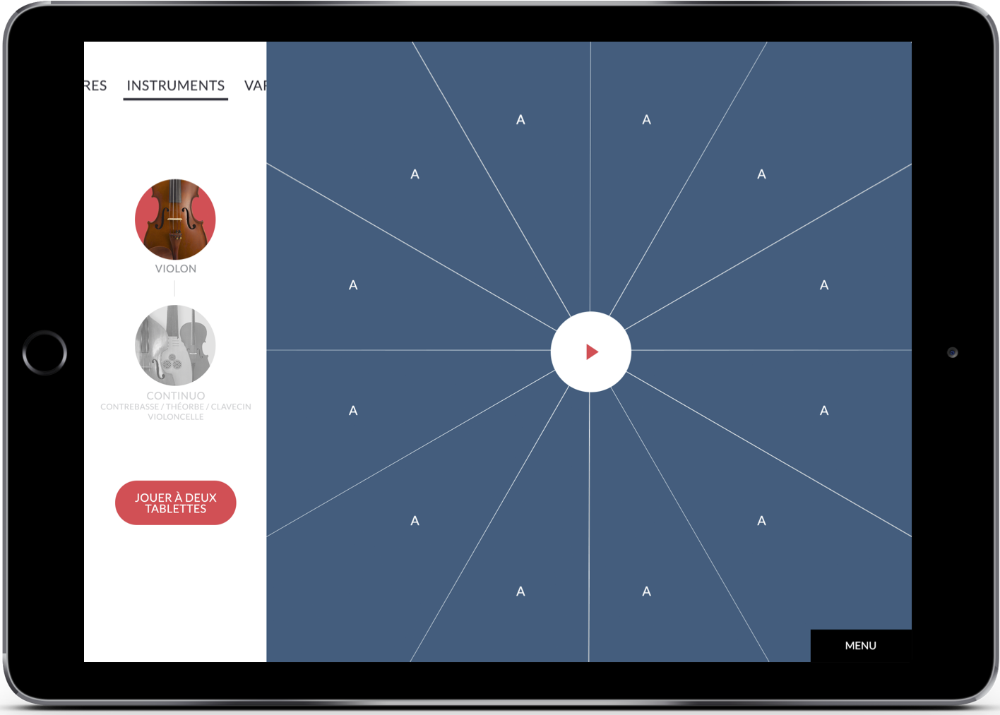

The *T@lenschool* project was born out of a collaboration between the baroque orchestra *Les Talens Lyriques* and the *OnOffOn* collective. *Les Talens Lyriques* are often doing residencies in Parisian high schools where they settle for a few years, offering public rehearsals and music classes.

*T@lenschool* was thought as an addition to this offer, as three mobile apps that can be quickly deployed in the classroom. Each app allows to dive into specific aspects of the baroque repertoire, by giving students a hands-on experience of being conductor, the interpret or the composer.

## *Composing* app

In this app, a theme is looped over a few bars, and each bar can be replaced with a variation or the theme. While playing with this sort of musical jigsaw puzzle, one starts paying attention to the fine music parameters that make up the different variations and their relation to the original theme. Students 

## Preview

In this screen cast, you can see the Folia theme looping over 16 bars. The color palette on the left holds the variations played on the violin. You can pick a variation and listen to the particular traits of each one, compose your own sequence, save it in a memory slot and retrieve it from your online account.

<iframe src="https://player.vimeo.com/video/338895848" width="640" height="360" frameborder="0" allow="autoplay; fullscreen" allowfullscreen></iframe>

### Links

- The project page on the  [Talens Lyriques website](https://www.lestalenslyriques.com/en/tlenschool-apps/)
- The *Interpretation* app, developped by Matthias Demoucron: [iOS version](https://itunes.apple.com/fr/app/interpr%C3%A9ter/id1230873613?mt=8) - [Android version](https://play.google.com/store/apps/details?id=com.onoffon.talenschool.atelier3)
- Member of the OnOffOn collective: [Clément Lebrun](http://www.clementlebrun.com/), [Matthias Demoucron](http://www.fingerfiddleapp.com/)
- Download the  [Android version](https://play.google.com/store/apps/details?id=com.onoffon.talenschool.atelier2&pcampaignid=MKT-Other-global-all-co-prtnr-py-PartBadge-Mar2515-1)
- Download the [iOS version](https://itunes.apple.com/fr/app/composer/id1233184310)

