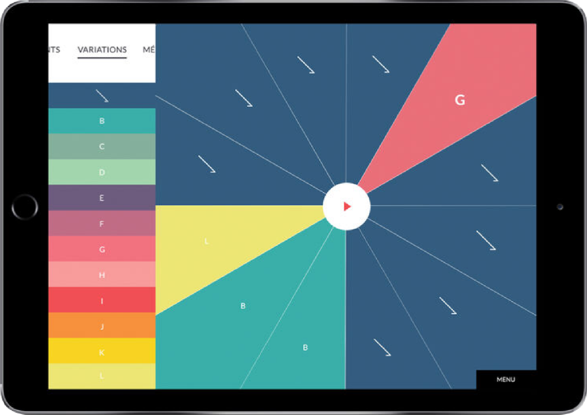

Conception et développement des apps pour Android et iOS

# Enjeux 

Download: 

<iframe src="https://player.vimeo.com/video/338910434" width="640" height="480" frameborder="0" allow="autoplay; fullscreen" allowfullscreen></iframe>

And

<iframe src="https://player.vimeo.com/video/338895848" width="640" height="360" frameborder="0" allow="autoplay; fullscreen" allowfullscreen></iframe>

[La page du projet](https://www.lestalenslyriques.com/applis-talenschool/)

[Jouer ensemble sur l'app store](https://itunes.apple.com/fr/app/jouer-ensemble/id1233988131)

[Composer sur l'app store](https://itunes.apple.com/fr/app/composer/id1233184310)

## Et aussi

<iframe width="560" height="315" src="https://www.youtube.com/embed/78xXiRhL74U" frameborder="0" allow="accelerometer; autoplay; encrypted-media; gyroscope; picture-in-picture" allowfullscreen></iframe>

