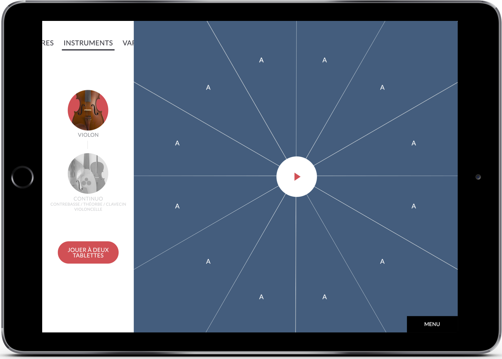
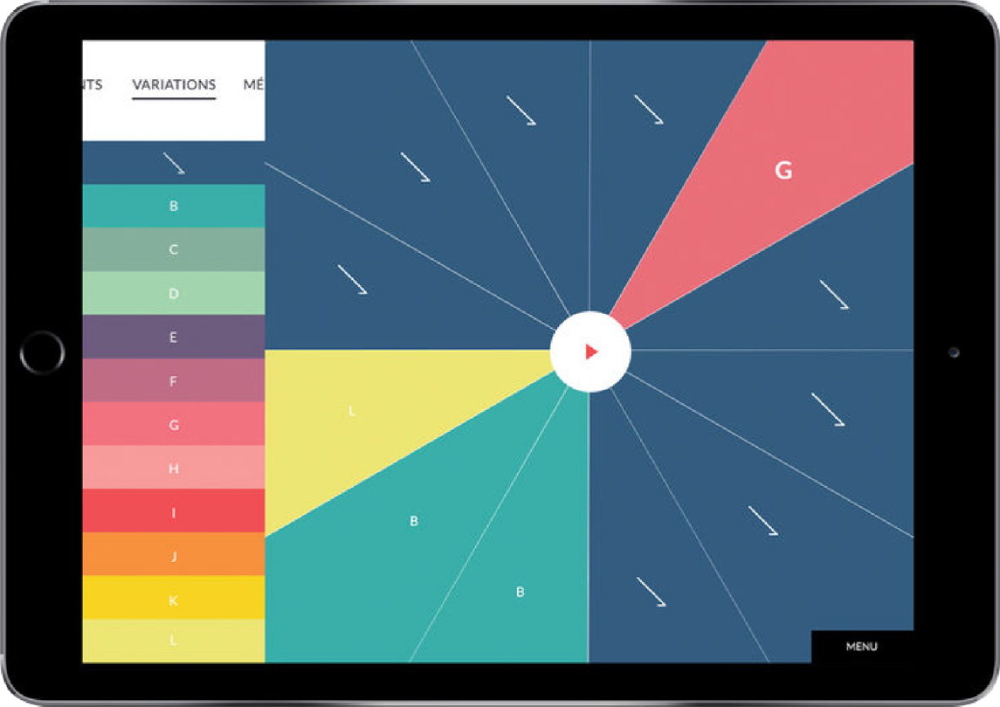
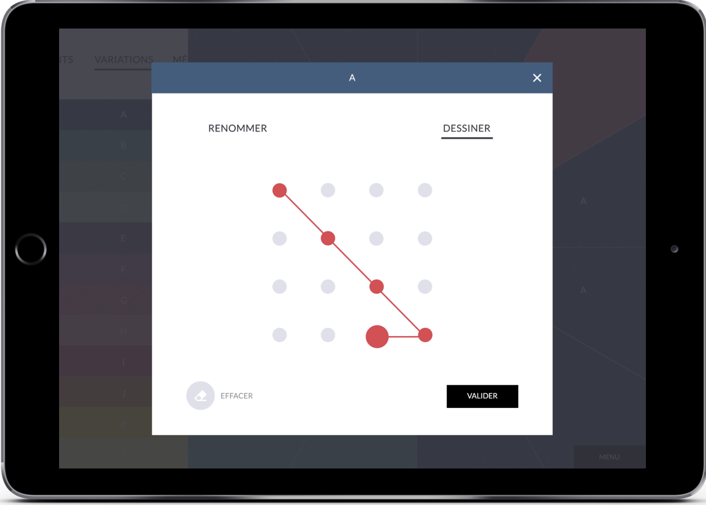

Le projet T@lenschool est né d'une collaboration entre l'ensemble baroque *Les Talens Lyriques* et le collectif *OnOffOn*. Les Talens Lyriques répètent régulièrement dans des collèges parisiens. De ces résidences naissent des actions pédagogiques de familiarisation à l'orchestre et au répertoire baroque. 

T@lenschool incarne l'une ce ces actions, sous la forme de trois applications mobiles utilisées en classe de musique. Chaque application permet d'aborder un aspect du répertoire en se glissant dans la peau du chef d'orchestre, du compositeur ou de l'interprète.

## Appli *Composer*

Cette application joue un thème en boucle, et permet de remplacer chaque mesure par une variation. En constituant une sorte de puzzle musical, on prête l'oreille aux différents paramètres musicaux qui permettent au compositeur de moduler autour d'un motif initial.  On peut s'approprier chaque variation en dessinant un motif géométrique de son choix.

## Aperçu

Dans la vidéo ci-dessous, on voit le thème de la Folia joué en boucle sur 16 mesures. La palette sur la gauche représente les variations du thème initial exécutées au violon. On peut appliquer une variation sur l'une des 16 mesures de la boucle, et écouter les particularités de chacune. L'utilisateur peut sauvegarder ses montages dans 8 mémoires différentes, et les sauver dans son compte en ligne.

<iframe src="https://player.vimeo.com/video/338895848" width="640" height="360" frameborder="0" allow="autoplay; fullscreen" allowfullscreen></iframe>

### Liens

- La page du projet [sur le site des Talens Lyriques](https://www.lestalenslyriques.com/applis-talenschool/)
- L'application *Interpréter*, dévelopée par Matthias Demoucron: [version iOS](https://itunes.apple.com/fr/app/interpr%C3%A9ter/id1230873613?mt=8) - [version Android](https://play.google.com/store/apps/details?id=com.onoffon.talenschool.atelier3)
- Membres du collectif OnOffOn: [Clément Lebrun](http://www.clementlebrun.com/), [Matthias Demoucron](http://www.fingerfiddleapp.com/)
- Télécharger [la version Android](https://play.google.com/store/apps/details?id=com.onoffon.talenschool.atelier2&pcampaignid=MKT-Other-global-all-co-prtnr-py-PartBadge-Mar2515-1)
- Télécharger [la version iOS](https://itunes.apple.com/fr/app/composer/id1233184310)

[La page du projet](https://www.lestalenslyriques.com/applis-talenschool/)

[Jouer ensemble sur l'app store](https://itunes.apple.com/fr/app/jouer-ensemble/id1233988131)

[Composer sur l'app store](https://itunes.apple.com/fr/app/composer/id1233184310)

## Et aussi

