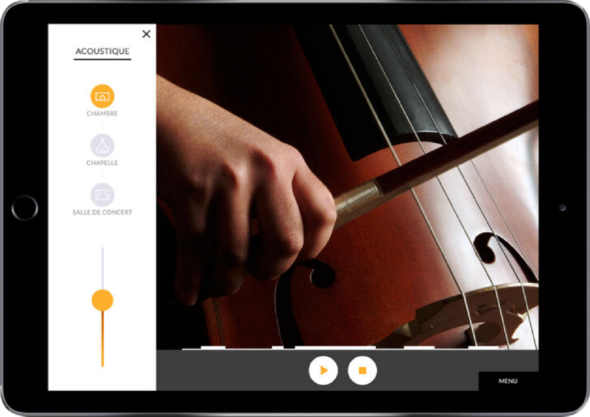
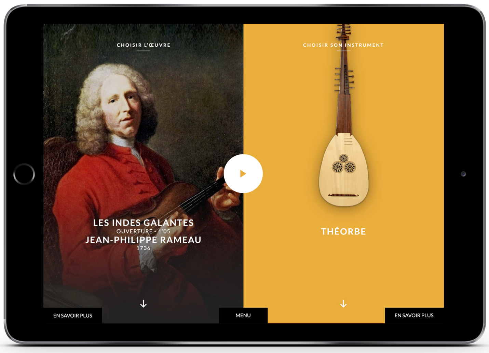

The *T@lenschool* project was born out of a collaboration between the baroque orchestra [Les Talens Lyriques](https://www.lestalenslyriques.com/en/) and the *OnOffOn* collective. *Les Talens Lyriques* are often doing residencies in Parisian high schools where they settle for a few years, offering public rehearsals and music classes.

*T@lenschool* was thought as an addition to this offer, as three mobile apps that can be quickly deployed in the classroom. Each app allows to dive into specific aspects of the baroque repertoire, by giving students a hands-on experience of being conductor, the interpret or the composer.

## *Playing together* app

This app allow to deploy an orchestra in the classroom. Each student picks an instrument and can change the volume and the ornementations.

## Classroom usage

The app development evolved through constant feedback from the educators team of the orchestra and from the music teachers at school. The final app is a result of several iterations over the years.

In this video, you can see a previous working prototype used in the classroom:

<iframe width="560" height="315" src="https://www.youtube.com/embed/78xXiRhL74U" frameborder="0" allow="accelerometer; autoplay; encrypted-media; gyroscope; picture-in-picture" allowfullscreen></iframe>

## Technical challenges

### Syncing

In order for the orchestra to sound proper, the music must start exactly at the same time on all devices. We used state of the art technology that allow devices to sync with audio sample precision within a same wifi network.

###  Video monitoring
Each tablet can be either to interpret or conductor mode. The latter allows the tablet to monitor the other tablets' activity in real time, with a video mosaic.

This video shows both of these aspects:

<iframe src="https://player.vimeo.com/video/338910434" width="640" height="480" frameborder="0" allow="autoplay; fullscreen" allowfullscreen></iframe>

### Links

- The project page on the  [Talens Lyriques website](https://www.lestalenslyriques.com/en/tlenschool-apps/)
- The *Interpretation* app, developped by Matthias Demoucron: [iOS version](https://itunes.apple.com/fr/app/interpr%C3%A9ter/id1230873613?mt=8) - [Android version](https://play.google.com/store/apps/details?id=com.onoffon.talenschool.atelier3)
- Member of the OnOffOn collective: [Clément Lebrun](http://www.clementlebrun.com/), [Matthias Demoucron](http://www.fingerfiddleapp.com/)
- Download the  [Android version](https://play.google.com/store/apps/details?id=com.onoffon.talenschool.atelier2&pcampaignid=MKT-Other-global-all-co-prtnr-py-PartBadge-Mar2515-1)
- Download the [iOS version](https://itunes.apple.com/fr/app/composer/id1233184310)