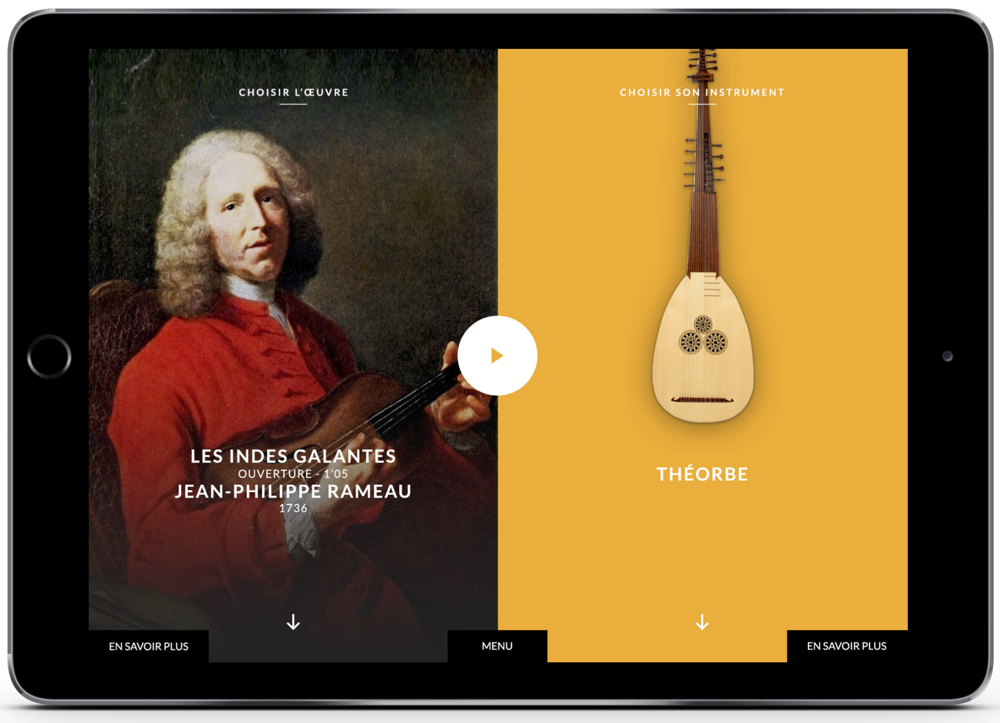
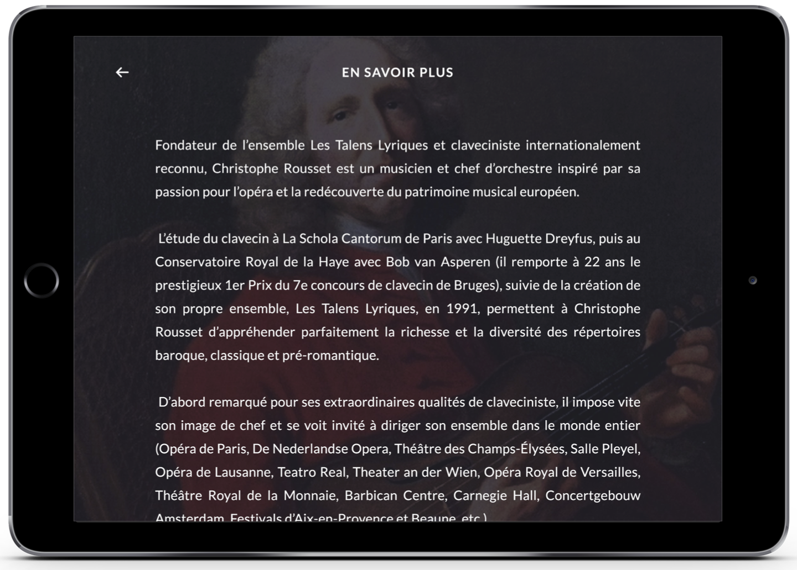

Le projet T@lenschool est né d'une collaboration entre l'ensemble baroque *Les Talens Lyriques* et le collectif *OnOffOn*. Les Talens Lyriques répètent régulièrement dans des collèges parisiens. De ces résidences naissent des actions pédagogiques de familiarisation à l'orchestre et au répertoire baroque. 

T@lenschool incarne l'une ce ces actions, sous la forme de trois applications mobiles utilisées en classe de musique. Chaque application permet d'aborder un aspect du répertoire en se glissant dans la peau du chef d'orchestre, du compositeur ou de l'interprète.

## App Jouer Ensemble

Cette application permet de créer un orchestre de tablettes en classe. Chaque élève choisit un instrument de l'orchestre, et peut jouer sur le volume et l'ornementation de sa partie. 

## Défis techniques

### Synchronisation
 Pour que l'orchestre sonne bien, il faut que le départ de la lecture sur chaque tablette soit finement synchronisé avec les autres. Cela nécessite l'utilisation de technologies avancées de synchronisation au sample près sur un réseau wifi. 

###  Retour vidéo 
L'une des tablette peut être utilisée comme retour vidée, pour le chef d'orchestre ou le reste de la classe, qui peut alors visualiser l'activité sur les autres tablettes en temps réel. 

La vidéo ci-dessous illustre ces deux aspects:

<iframe src="https://player.vimeo.com/video/338910434" width="640" height="480" frameborder="0" allow="autoplay; fullscreen" allowfullscreen></iframe>

### Liens

- La page du projet [sur le site des Talens Lyriques](https://www.lestalenslyriques.com/applis-talenschool/)
- Membres du collectif OnOffOn: [Clément Lebrun](http://www.clementlebrun.com/), [Matthias Demoucron](http://www.fingerfiddleapp.com/)
- Télécharger [la version Android](https://play.google.com/store/apps/details?id=com.lestalenslyriques.jouerensemble&pcampaignid=MKT-Other-global-all-co-prtnr-py-PartBadge-Mar2515-1)
- Télécharger [la version iOS](https://itunes.apple.com/fr/app/jouer-ensemble/id1233988131)
