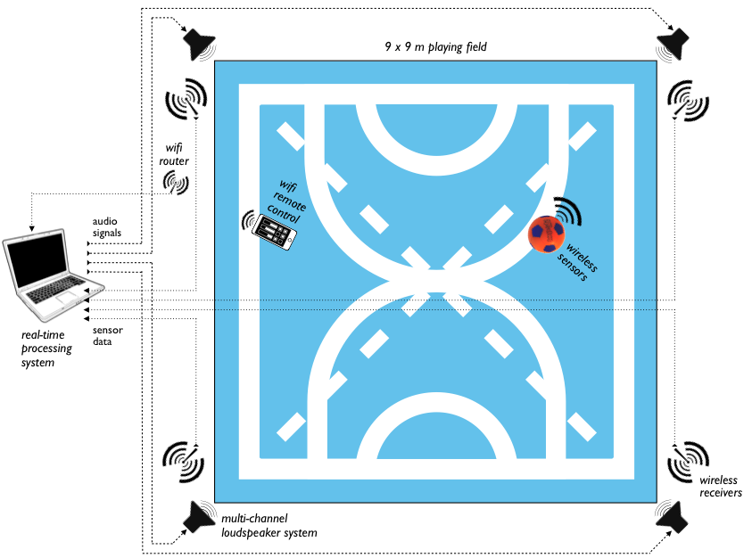

*Urban Musical Game* offers visitors a series of games that eplore a space between music, danse and sports gestures. Each game uses the ball's motion as an controls for evolving elements in a pre-recorded music piece.

I worked on this project as part of the Real Time Music Interaction team at IRCAM. The installation was presented publicly during the summer of 2011, on the Stravinsky place in Paris.

<iframe width="560" height="315" src="https://www.youtube.com/embed/jXGlvmrGBgY" frameborder="0" allow="accelerometer; autoplay; encrypted-media; gyroscope; picture-in-picture" allowfullscreen></iframe>

<iframe src="https://player.vimeo.com/video/26413625" width="640" height="360" frameborder="0" allow="autoplay; fullscreen" allowfullscreen></iframe>

