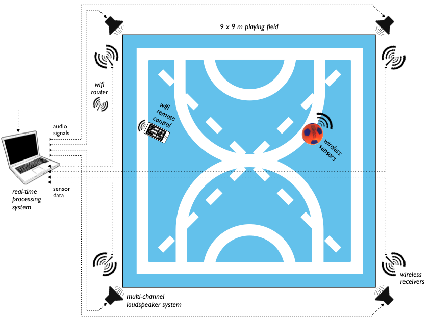
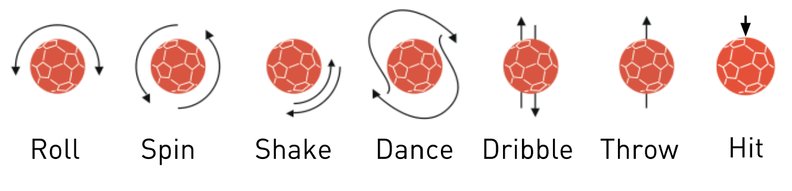

<iframe width="560" height="315" src="https://www.youtube.com/embed/jXGlvmrGBgY" frameborder="0" allow="accelerometer; autoplay; encrypted-media; gyroscope; picture-in-picture" allowfullscreen></iframe>

<iframe src="https://player.vimeo.com/video/26413625" width="640" height="360" frameborder="0" allow="autoplay; fullscreen" allowfullscreen></iframe>

